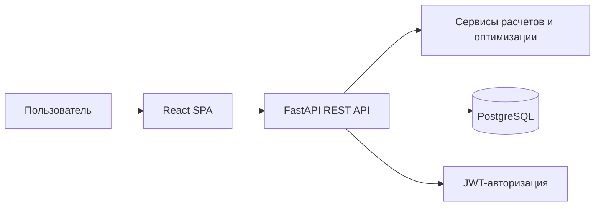
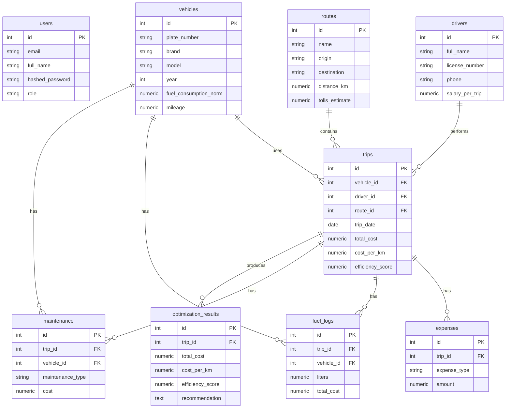

# Автоматизированная система учета и оптимизации транспортных расходов

Дипломный проект на связке **Python FastAPI + PostgreSQL + React**.

Система предназначена для учета автопарка, водителей, маршрутов, рейсов и затрат предприятия. Приложение рассчитывает себестоимость рейса, стоимость одного километра, строит аналитику расходов и формирует рекомендации по оптимизации транспортных затрат.

## Архитектура

- **Frontend:** React, React Router, Axios, Recharts, Vite.
- **Backend:** FastAPI, SQLAlchemy, Alembic, JWT.
- **Database:** PostgreSQL.
- **Интеграция:** REST API `/api/v1`.



## ER-модель



## Структура проекта

```text
backend/
  app/
    api/v1/endpoints/
    core/
    db/
    models/
    schemas/
    services/
    main.py
    seed.py
  alembic/
  requirements.txt
frontend/
  src/
    api/
    components/
    pages/
  package.json
docker-compose.yml
```

## Основные API endpoints

- `POST /api/v1/auth/register` - регистрация.
- `POST /api/v1/auth/login` - вход и получение JWT.
- `GET /api/v1/auth/me` - текущий пользователь.
- `GET|POST|PUT|DELETE /api/v1/vehicles` - автомобили.
- `GET|POST|PUT|DELETE /api/v1/drivers` - водители.
- `GET|POST|PUT|DELETE /api/v1/routes` - маршруты.
- `GET|POST|PUT|DELETE /api/v1/trips` - рейсы.
- `GET|POST|PUT|DELETE /api/v1/expenses` - расходы.
- `GET|POST|PUT|DELETE /api/v1/fuel-logs` - топливо.
- `GET|POST|PUT|DELETE /api/v1/maintenance` - обслуживание.
- `GET /api/v1/analytics/summary` - сводные показатели.
- `GET /api/v1/analytics/expenses-by-type` - расходы по типам.
- `GET /api/v1/analytics/costs-by-month` - динамика расходов.
- `POST /api/v1/optimization/run` - запуск оптимизации.
- `GET /api/v1/optimization/results` - результаты оптимизации.
- `GET /api/v1/reports/trips` - отчет по рейсам.
- `GET /api/v1/reports/expenses` - отчет по расходам.

## Алгоритм оптимизации

Для каждого рейса рассчитываются показатели:

```text
total_cost = fuel_cost + driver_salary + maintenance_cost + tolls + depreciation + other_costs
cost_per_km = total_cost / distance_km
efficiency_score = distance_km / total_cost
```

Система дополнительно:

- находит самый дешевый маршрут;
- находит самый дорогой рейс;
- определяет автомобили с высоким расходом топлива;
- формирует рекомендации по замене автомобиля, смене маршрута, снижению холостого пробега, проверке технического состояния и пересмотру загрузки транспорта.

## Запуск через Docker

```bash
docker compose up --build
```

После запуска:

- Frontend: http://localhost:5173
- Backend API: http://localhost:8000/api/v1
- Swagger: http://localhost:8000/docs

Тестовый пользователь создается автоматически:

```text
email: admin@example.com
password: admin123
```

## Локальный запуск backend

```bash
cd backend
python -m venv .venv
.venv\Scripts\activate
pip install -r requirements.txt
copy .env.example .env
alembic upgrade head
python -m app.seed
uvicorn app.main:app --reload
```

## Локальный запуск frontend

```bash
cd frontend
npm install
npm run dev
```

## Публикация в GitHub

Если репозиторий еще не создан:

```bash
git init -b main
git add .
git commit -m "Initial diploma project"
gh repo create transport-cost-optimization --public --source=. --remote=origin --push
```

Если репозиторий уже создан:

```bash
git init -b main
git add .
git commit -m "Initial diploma project"
git remote add origin https://github.com/<username>/<repository>.git
git push -u origin main
```
